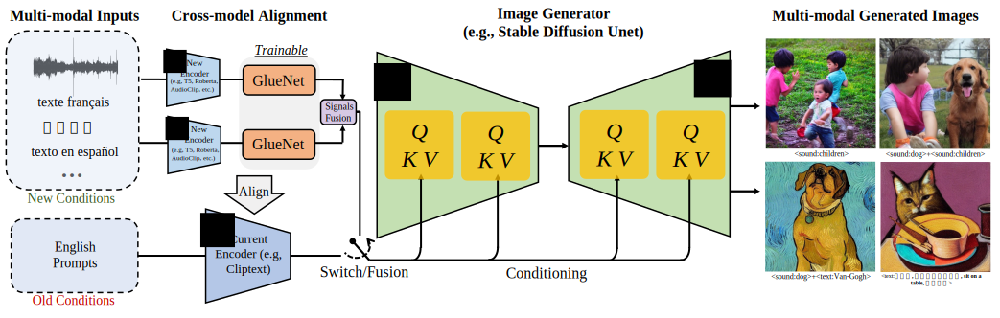
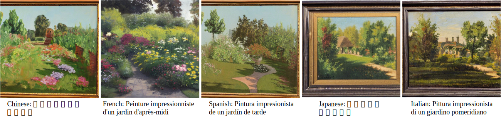
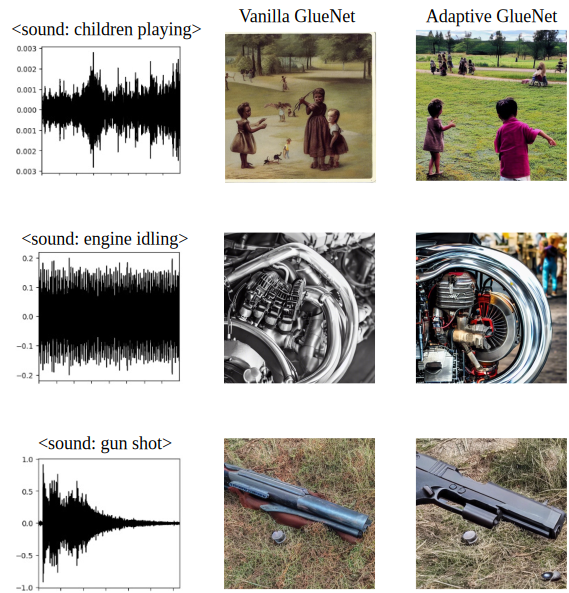
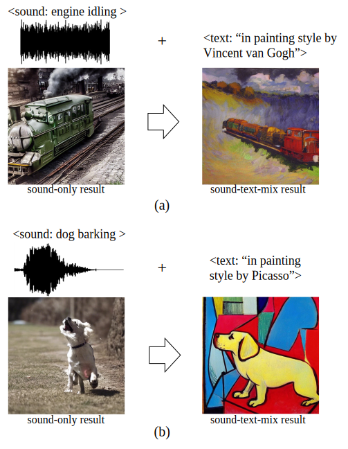

# [GlueGen](https://arxiv.org/pdf/2303.10056.pdf) [](https://arxiv.org/pdf/2303.10056) []()

<div align="center">
    <a></a>
    <a></a>
    <a></a>
</div>

This repository is for the paper:
> **[GlueGen: Plug and Play Multi-modal Encoders for X-to-image Generation](https://arxiv.org/pdf/2303.10056)** \
> Can Qin <sup>1</sup>, Ning Yu <sup>2</sup>, Chen Xing <sup>2</sup>, Shu Zhang <sup>2</sup>, Zeyuan Chen <sup>2</sup>, Stefano Ermon <sup>3</sup>, Yun Fu <sup>1</sup>, Caiming Xiong <sup>2</sup>, Ran Xu <sup>2</sup> \
> <sup>1</sup> Northeastern University <sup>2</sup> Salesforce AI Research <sup>3</sup> Stanford Univerisy \
> Work done when Can Qin was an intern at Salesforce AI Research.


<section class="hero teaser">
    <div class="container is-max-desktop">
      <div class="hero-body">
        <div align='center'>
          <a></a>
        </div>
        <div class="content has-text-justified">
          With the proposed GlueNet model of the GlueGen framework, the pre-trained image generator (i.e., UNet) can be bridged to off-the-shelf single- or multi-modal encoders to expand their functionalities, i.e., multilingual/sound-to-image generation, within a limited budget. GlueNet is trained offline and does not require back-propagation of UNet and image-text pairs for training. Therefore, GlueGen is flexible and efficient to achieve.
        </div>
      </div>
    </div>
  </section>

-----
## Multilingual Text to Image Generation
<section class="hero teaser">
    <div class="container is-max-desktop">
      <div class="hero-body">
        <div align='center'>
          <a></a>
          <div class="content has-text-justified">
           Multilingual text-to-image generation results in resolution 512 * 512  of XLM-Roberta + Glue-Net + SDM decoder with the same caption, ``afternoon garden oil painting painted by impressionists".
        </div>
        </div>
      </div>
    </div>
  </section>


## Sound to Image Generation
<section class="hero teaser">
    <div class="container is-max-desktop">
      <div class="hero-body">
        <div align='center'>
          <a></a>
          <div class="content has-text-justified">
          Example sound (Urbansound8k) to image generation results.
        </div>
        </div>
      </div>
    </div>
  </section>

## Sound-text-mix to Image Generation
<section class="hero teaser">
    <div class="container is-max-desktop">
      <div class="hero-body">
        <div align='center'>
          <a></a>
          <div class="content has-text-justified">
          (a) and (b) are example sound-text-mix to image generation results.
        </div>
        </div>
      </div>
    </div>
  </section>


-----

## Instruction for GlueGen
### Environment Preparation
Setup the env of stable-diffusion first.
```
cd ./stable-diffusion
conda env create -f environment.yaml
conda activate sdm
```

Then, install the packages for audioclip (only needed for sound-to-image generation).
```
cd ./stable-diffusion/audioclip
pip install -r requirements.txt
pip install -U llvmlite==0.32.1
```


### Download Checkpoints
Download the official checkpoints of SD v1 to ./checkpoints_all/checkpoint_sd_v1 as ./checkpoints_all/checkpoint_sd_v1/v1-5-pruned-emaonly.ckpt (from https://huggingface.co/runwayml/stable-diffusion-v1-5).

Then follow the README.md (./stable-diffusion/audioclip/README.md) of audioclip to download checkpoints  to ./checkpoints_all/audioclip_checkpoint as  ./checkpoints_all/audioclip_checkpoint/AudioCLIP-Full-Training.pt.

```
mkdir ./checkpoints_all/audioclip_checkpoint
cd ./checkpoints_all/audioclip_checkpoint
wget https://github.com/AndreyGuzhov/AudioCLIP/releases/download/v0.1/AudioCLIP-Full-Training.pt
```

Download the pretrained gluenet checkpoints and save them to ./checkpoints_all/gluenet_checkpoint

### Download Datasets
Download audio dataset (urbansound8k) to ./data as ./data/urbansound8k

Download multilingual text dataset to ./data

### Running Inference Code
Multilingual Stable Diffusion Inference:
```
cd stable-diffusion

python scripts/txt2img_demo_ml.py --prompt "下午的花园的印象派绘画" --plms --outdir outputs/text2img-multilingual --ckpt ../checkpoints_all/checkpoint_sd_v1/v1-5-pruned-emaonly.ckpt

python scripts/txt2img_demo_ml.py --prompt "Peinture impressionniste d'un jardin d'après-midi" --plms --outdir outputs/text2img-multilingual --ckpt ../checkpoints_all/checkpoint_sd_v1/v1-5-pruned-emaonly.ckpt

python scripts/txt2img_demo_ml.py --prompt "Pintura impresionista de un jardín de tarde" --plms --outdir outputs/text2img-multilingual --ckpt ../checkpoints_all/checkpoint_sd_v1/v1-5-pruned-emaonly.ckpt

python scripts/txt2img_demo_ml.py --prompt "午後の庭の印象派絵画" --plms --outdir outputs/text2img-multilingual --ckpt ../checkpoints_all/checkpoint_sd_v1/v1-5-pruned-emaonly.ckpt

python scripts/txt2img_demo_ml.py --prompt "Pittura impressionista di un giardino pomeridiano" --plms --outdir outputs/text2img-multilingual --ckpt ../checkpoints_all/checkpoint_sd_v1/v1-5-pruned-emaonly.ckpt
```

Sound-to-image Stable Diffusion Inference:
```
cd stable-diffusion

python scripts/sound2img_gluegen.py --plms --ckpt ../checkpoints_all/checkpoint_sd_v1/v1-5-pruned-emaonly.ckpt --outdir outputs/sound2img --config configs/stable-diffusion/v1-inference-trans-audioclip.yaml --scale 7.5  --n_iter 1 --audioclip_ckpt ../checkpoints_all/audioclip_checkpoint/AudioCLIP-Full-Training.pt

```

### Running Training Code
Sound-to-image GlueNet Training:
```
cd ./sound-gluenet
CUDA_VISIBLE_DEVICES=0 python -m torch.distributed.launch --nproc_per_node=1 --nnodes=1 train_gluenet_sound_text.py
```

Multilingual Text-to-image GlueNet Training:
```
CUDA_VISIBLE_DEVICES=0 python train_gluenet_multi.py --DATA_PATH_SRC ../data/WikiMatrix.en-zh.txt.en --DATA_PATH_TAR ../data/WikiMatrix.en-zh.txt.zh --DATA_PATH_SRC_1 ../data/laion-1M-trans-en-zh-cn-en.txt --DATA_PATH_TAR_1 ../data/laion-1M-trans-en-zh-cn-zh-cn.txt --tarLanguage Chinese
```

## Citation
If you find this project useful for your research, please kindly cite our paper:

```bibtex
@article{qin2023gluegen,
  title={GlueGen: Plug and Play Multi-modal Encoders for X-to-image Generation},
  author={Qin, Can and Yu, Ning and Xing, Chen and Zhang, Shu and Chen, Zeyuan and Ermon, Stefano and Fu, Yun and Xiong, Caiming and Xu, Ran},
  journal={arXiv preprint arXiv:2303.10056},
  year={2023}
}
```

## Contact
If you have any questions, please contact [Can Qin](qin.ca@northeastern.edu).

## Acknowledgement
Stable Diffusion https://github.com/CompVis/stable-diffusion

AudioCLIP https://github.com/AndreyGuzhov/AudioCLIP

